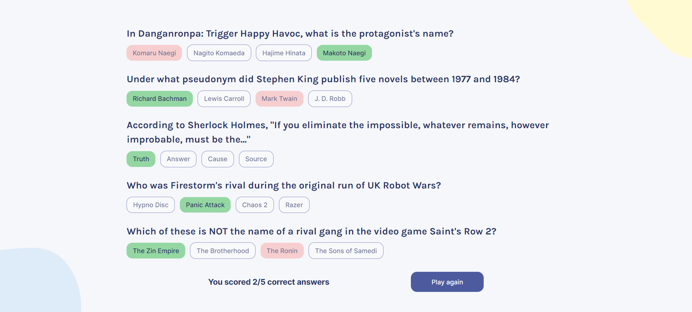

# Quizical - Scrimba

This is a SOLO project suggested in Scrimba's Learn React Course

## Screenshot

## Links

- Live Site URL: https://main--cl4ram-quizical.netlify.app/

## My process

- useState and useEffect
- Conditional rendering

## To-do

- Let the user choose the category, difficulty and amount of questions to play
- Add animation of missing selected answers when missing some
- Use React Router to create different views 
- Add correct/incorrect image beside each question when answers are checked